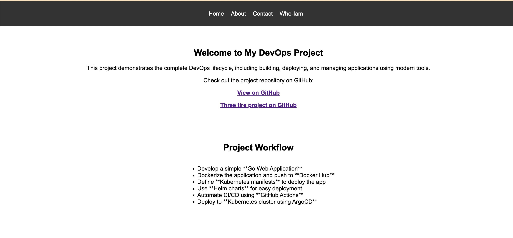

# Go Web Application

Website written in Golang. It uses the `net/http` package to serve HTTP requests.

**Features**

* Developed a web application using Go
* Dockerized the application and pushed it to Docker Hub
* Kubernetes manifests defined for deployment
* Helm charts used for simplified deployment
* Automated CI/CD pipeline using GitHub Actions
* Deployed to Kubernetes using ArgoCD
* Configured Kubernetes Deployment with Replica Count: 2
* Used Ingress Controller for external access

## Running the server

To run the server, execute the following command:

```bash
go run main.go
```

The server will start on port 8080. You can access it by navigating to `http://localhost:8080/courses` in your web browser.

## Looks like this
Screenshot 2025-02-22 at 13.51.13



**Improvemnts when it comes to production** 

**If we want url to be use https instead of http** 
**Generate a Self-Signed Certificate, this will generate tls.crt and tls.key**
```sh
openssl req -x509 -nodes -days 365 -newkey rsa:2048 \
  -keyout tls.key -out tls.crt -subj "/CN=<EXTERNAL_IP>" \
  -addext "subjectAltName = IP:<EXTERNAL_IP>"`
```
**Create a Kubernetes TLS Secret, Store the certificate in Kubernetes as a secret:**
```sh
  kubectl create secret tls gke-selfsigned-tls \
      --cert=tls.crt --key=tls.key
```
**Update Ingress to Use TLS**

```apiVersion: networking.k8s.io/v1
kind: Ingress
metadata:
  name: go-web-app
  annotations:
    nginx.ingress.kubernetes.io/rewrite-target: /
spec:
  ingressClassName: nginx
  tls:
  - hosts:
    - "<EXTERNAL_IP>"  
    secretName: gke-selfsigned-tls
  rules:
  - host: "<EXTERNAL_IP>"
    http:
      paths:
      - path: /
        pathType: Prefix
        backend:
          service:
            name: go-web-app
            port:
              number: 80
  ```


# Improvements for Production Deployment on Cloud Providers

## Security Enhancements

- Implement HTTPS using **Managed SSL Certificates**

- Use **Secrets Management Services** for secure secret storage

- Enforce **Role-Based Access Control (RBAC)** for better security.  
- Enable **IAM Roles for Service Accounts** to securely access cloud resources.
- Use self-hosted runner or codepipline from cloud provider , because git hub hosted runner we don't have a control so we don't know what is happening under the hood so our code is more private hence better to avoid it.
- Integration with trivy, sonarcube as security to the github operation
- Network Policies to Restrict Traffic deploy with yaml file
- Admision control policy

## Scalability & High Availability

- Increase **replica count** and configure **Horizontal Pod Autoscaler (HPA)**:  

  ```sh
  kubectl autoscale deployment <deployment_name> --cpu-percent=80 --min=2 --max=5

## Logging & Monitoring
Integrate with Cloud Monitoring Services:
Use Centralized Logging for improved observability
Instrumention using opentelimetry etc

## CI/CD Practices
Add Canary Deployments or Blue-Green Deployment using ArgoCD

## Access argocd 
http://34.56.38.194/

## UI 
http://104.154.168.167/home.html